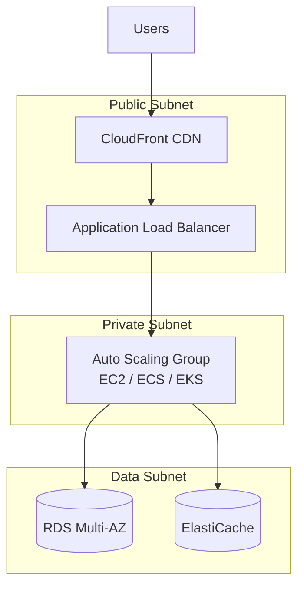
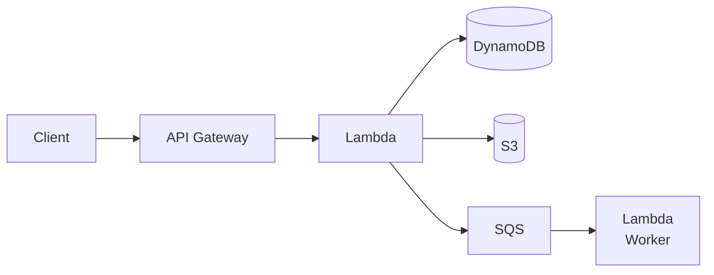
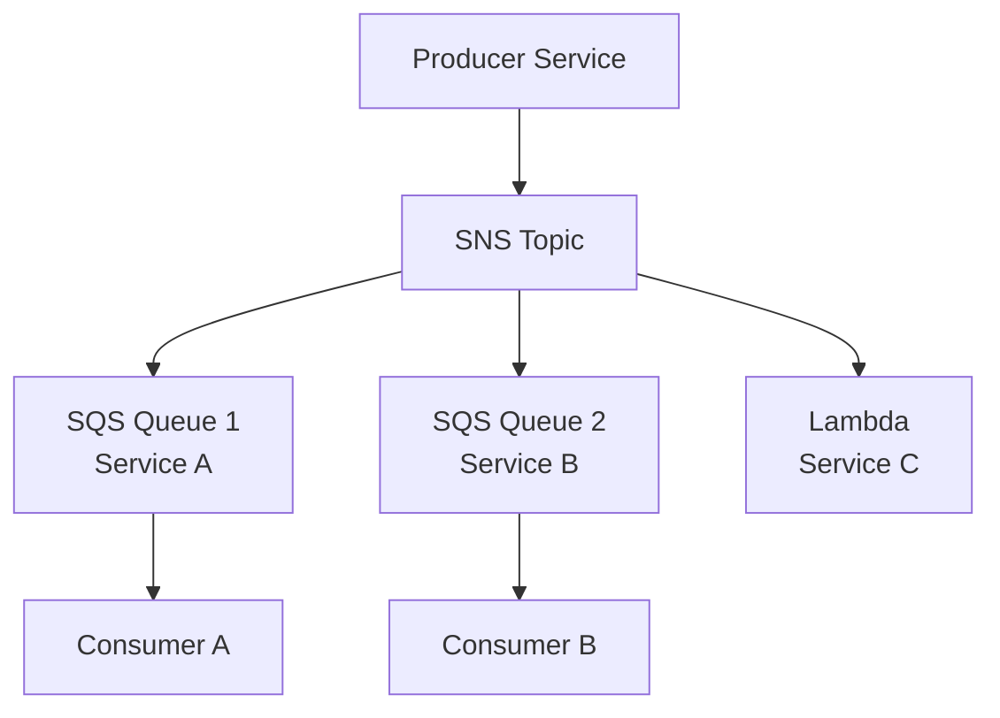
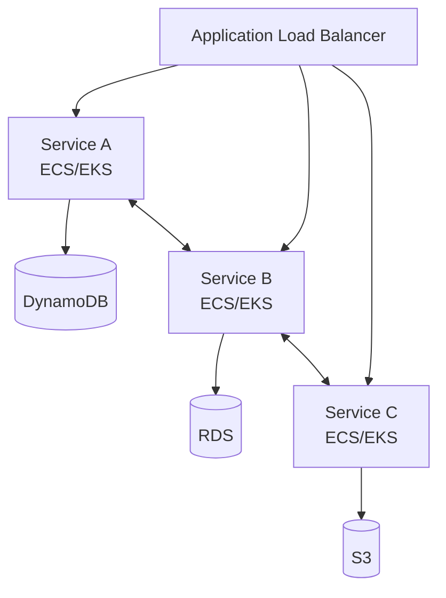
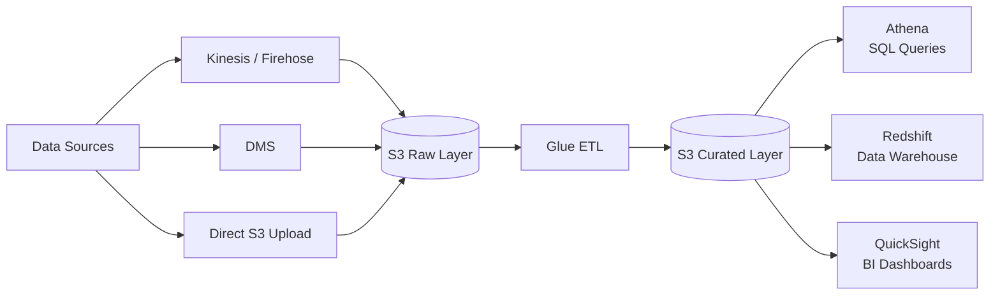
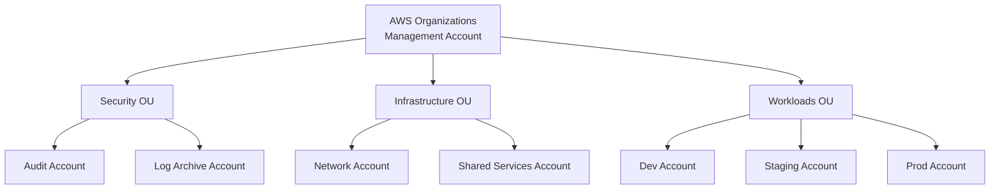
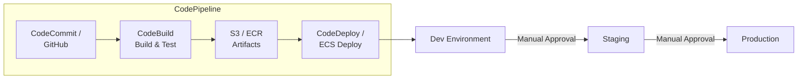

# AWS Architecture Patterns

Common architecture patterns on AWS and when to use each one.

## Three-Tier Web Application

Classic pattern for web applications with a presentation, application, and data tier.

**When to use:** Traditional web applications, CMSs, e-commerce platforms.

**Key components:**

| Tier | AWS Services |
|------|-------------|
| Presentation | CloudFront, S3 (static assets), ALB |
| Application | EC2 in ASG, ECS, or EKS |
| Data | RDS Multi-AZ, ElastiCache, S3 |

**Best practices:**

* Place ALB in public subnets, application in private subnets, database in isolated subnets
* Use Auto Scaling Groups for the application tier
* Enable Multi-AZ for RDS
* Cache frequently accessed data in ElastiCache
* Serve static assets from S3 + CloudFront

## Serverless API

Event-driven, pay-per-use pattern with no servers to manage.

**When to use:** APIs with variable traffic, microservices, rapid prototyping, event processing.

**Key components:** API Gateway, Lambda, DynamoDB, S3, SQS/SNS.

**Best practices:**

* Use HTTP API (not REST API) for lower cost and latency when full REST API features aren't needed
* DynamoDB with on-demand capacity for unpredictable traffic
* SQS between services for decoupling and retry
* Use Lambda Powertools for structured logging, tracing, and idempotency
* Keep Lambda functions small and focused (single responsibility)
* Set appropriate memory (affects both memory and CPU allocation)

## Event-Driven / Fan-Out

Decouple producers from consumers using messaging services.

**When to use:** Multiple consumers need to process the same event independently.

**Key pattern: SNS + SQS (fanout)**

* SNS topic fans out to multiple SQS queues
* Each queue has its own consumer that processes at its own pace
* Failed messages go to per-queue dead-letter queues
* Consumers are decoupled — adding/removing consumers doesn't affect others

**Alternative: EventBridge**

* Richer event filtering and routing rules
* Schema registry for event discovery
* Better for cross-account and SaaS integration events

## Microservices on Containers

Run microservices in containers with managed orchestration.

**When to use:** Complex applications with multiple teams, polyglot services, need for independent scaling and deployment.

| Approach | When to Choose |
|----------|---------------|
| ECS on Fargate | Simplest; no cluster management; smaller teams |
| ECS on EC2 | Need GPU, specific instance types, or cost control |
| EKS | Already invested in Kubernetes; need portability; advanced scheduling |
| EKS on Fargate | Kubernetes API but no node management |

**Best practices:**

* One service per repository (or well-structured monorepo)
* Service discovery via AWS Cloud Map or internal ALB
* Each service owns its own data store
* Use App Mesh or service mesh for observability and traffic management
* Store images in ECR with image scanning enabled

## Data Lake

Centralised repository for structured and unstructured data at any scale.

**When to use:** Analytics, ML training data, regulatory data retention, consolidating data from multiple sources.

**Key layers:**

| Layer | Purpose | Format |
|-------|---------|--------|
| Raw / Landing | Ingested data as-is | JSON, CSV, logs |
| Curated / Processed | Cleaned, transformed, partitioned | Parquet, ORC |
| Consumption | Optimised for specific queries | Parquet with projections |

**Best practices:**

* Use S3 as the central storage layer
* Partition data by date or common query dimensions
* Use Parquet or ORC columnar formats for analytics
* AWS Glue Data Catalog as the metadata catalog
* Lake Formation for fine-grained access control
* Athena for ad-hoc SQL queries directly on S3

## Multi-Account Strategy

Organise workloads across multiple AWS accounts for isolation and governance.

**When to use:** Any production workload, regulatory compliance, team isolation, cost tracking.

**Best practices:**

* Use AWS Organizations with SCPs (Service Control Policies) for guardrails
* Separate accounts for security (audit, log archive), networking (Transit Gateway), and workloads (dev/staging/prod)
* AWS Control Tower for automated account provisioning with baseline guardrails
* Centralise logging in a dedicated log archive account
* Use AWS SSO (IAM Identity Center) for federated access across accounts
* Tag everything for cost allocation

## CI/CD Pipeline

Automated build, test, and deployment pipeline.

**When to use:** Any application needing automated, repeatable deployments.

| Service | Purpose |
|---------|---------|
| CodePipeline | Orchestrate the pipeline stages |
| CodeBuild | Build, test, produce artifacts |
| CodeDeploy | Deploy to EC2, ECS, Lambda |
| ECR | Container image registry |
| S3 | Artifact storage |

**Alternatives:** GitHub Actions, GitLab CI, Jenkins — all integrate well with AWS via IAM roles (OIDC federation for GitHub Actions).

## Disaster Recovery Strategies

| Strategy | RPO | RTO | Cost | Description |
|----------|-----|-----|------|-------------|
| Backup & Restore | Hours | Hours | $ | Backups in S3, restore when needed |
| Pilot Light | Minutes | 10s of minutes | $$ | Core services always running in DR region |
| Warm Standby | Minutes | Minutes | $$$ | Scaled-down copy running in DR region |
| Multi-Site Active/Active | Near zero | Near zero | $$$$ | Full-scale deployment in multiple regions |

**Best practices:**

* Use S3 cross-region replication for data
* RDS cross-region read replicas or Aurora Global Database
* Route 53 health checks with DNS failover
* Infrastructure as Code enables rapid re-deployment
* Test DR procedures regularly
