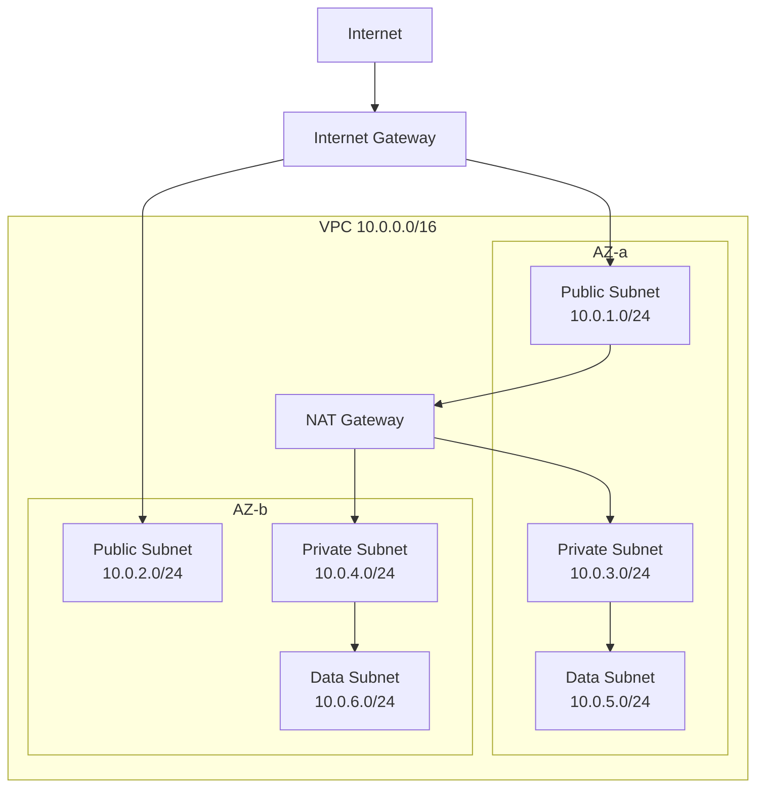
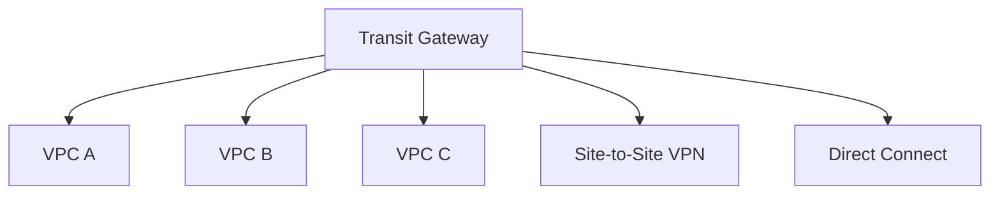

# AWS Networking

Reference for VPC design, connectivity, DNS, load balancing, and network security.

## VPC (Virtual Private Cloud)

### Core Components

| Component | Description |
|-----------|-------------|
| **VPC** | Logically isolated virtual network; defined by a CIDR block (e.g., `10.0.0.0/16`) |
| **Subnet** | Segment of a VPC in a single Availability Zone; public or private |
| **Route Table** | Rules that determine where network traffic is directed |
| **Internet Gateway (IGW)** | Allows public subnet resources to reach the internet |
| **NAT Gateway** | Allows private subnet resources to reach the internet (outbound only) |
| **Elastic IP** | Static public IPv4 address |

### Typical VPC Design



### Subnet Types

| Type | Route to Internet | Use For |
|------|------------------|---------|
| **Public** | Via Internet Gateway | Load balancers, bastion hosts, NAT Gateways |
| **Private** | Via NAT Gateway (outbound only) | Application servers, containers |
| **Isolated / Data** | No internet route | Databases, internal services |

**Best practice:** Use at least 2 AZs. Use `/24` or larger subnets. Plan CIDR blocks to avoid overlap if VPCs will be peered.

### CIDR Planning

| VPC Size | CIDR | Hosts | Typical Use |
|----------|------|-------|-------------|
| Small | /24 | 251 | Single-purpose, dev/test |
| Medium | /20 | 4,091 | Standard workload |
| Large | /16 | 65,531 | Large production |

**Reserved IPs per subnet:** AWS reserves 5 IPs (network, VPC router, DNS, future, broadcast).

## Network Security

### Security Groups

* **Stateful** — return traffic is automatically allowed
* Applied at the **ENI (instance)** level
* **Allow rules only** — no deny rules; default denies everything inbound
* Reference other security groups as sources (e.g., "allow inbound from ALB security group")

```bash
# Example: allow HTTP from ALB and SSH from bastion
aws ec2 authorize-security-group-ingress --group-id sg-xxx \
  --protocol tcp --port 80 --source-group sg-alb-xxx

aws ec2 authorize-security-group-ingress --group-id sg-xxx \
  --protocol tcp --port 22 --source-group sg-bastion-xxx
```

### Network ACLs (NACLs)

* **Stateless** — must explicitly allow both inbound and outbound
* Applied at the **subnet** level
* **Allow and deny rules** — evaluated in order by rule number (lowest first)
* Default NACL allows all traffic; custom NACLs deny all by default

**When to use NACLs:** As a secondary layer of defence; for explicit deny rules (e.g., block specific IP ranges).

### Security Groups vs NACLs

| Feature | Security Group | NACL |
|---------|---------------|------|
| Level | Instance (ENI) | Subnet |
| State | Stateful | Stateless |
| Rules | Allow only | Allow and deny |
| Evaluation | All rules evaluated | Rules evaluated in order |
| Default | Deny all inbound, allow all outbound | Allow all (default NACL) |

## VPC Connectivity

### VPC Peering

* Direct network route between two VPCs (same or different accounts/regions)
* Non-transitive — A↔B and B↔C does not mean A↔C
* No overlapping CIDR blocks
* No single point of failure or bandwidth bottleneck

### Transit Gateway

* Hub-and-spoke model connecting multiple VPCs, VPNs, and Direct Connect
* **Transitive routing** — all connected networks can communicate (controlled by route tables)
* Supports thousands of VPCs
* Cross-region peering between Transit Gateways



### VPC Endpoints

Access AWS services without going through the internet.

| Type | Services | How It Works |
|------|----------|-------------|
| **Gateway Endpoint** | S3, DynamoDB | Route table entry; free |
| **Interface Endpoint (PrivateLink)** | 100+ services | ENI in your subnet; per-hour + per-GB cost |

**Best practice:** Always create gateway endpoints for S3 and DynamoDB (free, improves security). Use interface endpoints for other services accessed from private subnets.

### Site-to-Site VPN

* Encrypted IPsec tunnel over the internet
* Virtual Private Gateway (AWS side) + Customer Gateway (on-premises side)
* Two tunnels per connection for redundancy
* Up to 1.25 Gbps per tunnel

### Direct Connect

* Dedicated network connection from on-premises to AWS
* 1 Gbps, 10 Gbps, or 100 Gbps ports
* Lower latency and more consistent throughput than VPN
* **Direct Connect Gateway** — connect to multiple VPCs in different regions from one connection
* Consider VPN as backup for Direct Connect

## Load Balancing

### Elastic Load Balancing (ELB) Types

| Type | Layer | Use Case |
|------|-------|----------|
| **ALB (Application)** | Layer 7 (HTTP/HTTPS) | Web apps, microservices, path/host routing, WebSocket |
| **NLB (Network)** | Layer 4 (TCP/UDP/TLS) | Ultra-low latency, static IPs, high throughput |
| **GLB (Gateway)** | Layer 3 (IP) | Inline traffic inspection (firewalls, IDS) |
| _CLB (Classic)_ | Layer 4/7 | Legacy only — migrate to ALB or NLB |

### ALB Key Features

* **Path-based routing** — `/api/*` → service A, `/web/*` → service B
* **Host-based routing** — `api.example.com` → service A, `web.example.com` → service B
* **Target groups** — EC2, IP, Lambda, or containers
* **Sticky sessions** — route a user to the same target
* **Authentication** — built-in OIDC/Cognito integration
* **WAF integration** — attach WAF ACL for security

### NLB Key Features

* Static IP per AZ (or Elastic IP)
* Millions of requests per second with ultra-low latency
* Preserves client source IP
* TLS termination or passthrough
* Required for AWS PrivateLink (exposing services to other VPCs)

## DNS — Route 53

### Hosted Zones

* **Public hosted zone** — resolves domain names from the internet
* **Private hosted zone** — resolves names within specified VPCs

### Routing Policies

| Policy | Use Case |
|--------|----------|
| Simple | Single resource |
| Weighted | A/B testing, gradual migration (e.g., 90/10 split) |
| Latency | Route to lowest-latency region |
| Failover | Active-passive with health checks |
| Geolocation | Route by user's geographic location |
| Geoproximity | Route by geographic proximity with bias |
| Multivalue | Return multiple healthy IPs (basic load distribution) |

### Health Checks

* Monitor endpoints (HTTP, HTTPS, TCP)
* Calculated health checks (combine multiple checks)
* CloudWatch alarm-based health checks
* Integrate with failover routing for automatic DNS failover

## Content Delivery — CloudFront

* Global CDN with 450+ edge locations
* Origins: S3, ALB, EC2, custom HTTP server, MediaStore
* **Edge functions:**

| Type | Runtime | Use Case |
|------|---------|----------|
| CloudFront Functions | JavaScript | Lightweight (header manipulation, URL rewrites, redirects) |
| Lambda@Edge | Node.js / Python | Complex logic (authentication, A/B testing, origin selection) |

* **Origin Access Control (OAC)** — restrict S3 access to CloudFront only (replaces OAI)
* **Cache behaviours** — different settings per URL path pattern
* **Signed URLs / Signed Cookies** — restrict access to content

## VPC Flow Logs

* Capture IP traffic metadata (source, destination, ports, action, bytes)
* Enable at VPC, subnet, or ENI level
* Deliver to CloudWatch Logs, S3, or Kinesis Data Firehose
* Use for troubleshooting connectivity, security analysis, and compliance
* **Not packet capture** — only metadata; use VPC Traffic Mirroring for full packet inspection
