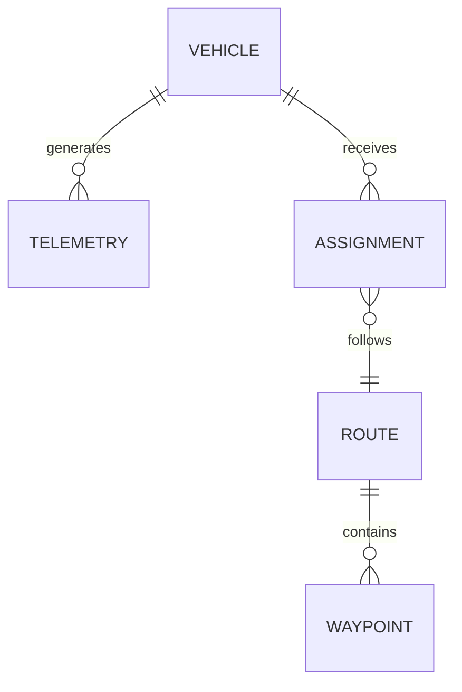

# Proven Patterns and Examples

Reusable patterns extracted from successful expert skills. Each pattern is presented as a generic archetype so it can be applied to any project of a similar shape.

## Pattern 1: Multi-Variant Product

**When to use:** The project ships multiple product variants built from shared components with variant-specific subsets (e.g. a base product, a precision variant, and a lightweight variant).

**Key techniques:**

* Dedicate a section to listing each variant with its use case and architecture diagram
* Use a **component table with a "Variants" column** showing which components apply to which variant
* Document variant-specific configuration files and how they differ
* Provide side-by-side comparisons when users ask "how does variant A differ from variant B?"

**Example component table:**

| Component | Purpose | Variants |
|-----------|---------|----------|
| `core-driver` | Primary sensor integration | All |
| `precision-module` | High-accuracy processing | Precision only |
| `lightweight-bridge` | Minimal network bridge | Lightweight only |

**Example variant section structure:**

```markdown
### Variant: <Name>

**Use case:** <one sentence>
**Architecture:**
<Mermaid diagram or ASCII art for this variant>
**Key additions over base:** <bullet list>
**Configuration:** `config/<variant>.xml`
```

---

## Pattern 2: Microservice / Multi-Stack Architecture

**When to use:** The project is composed of multiple independent services or stacks, each owning a specific domain (e.g. asset management, task orchestration, spatial data).

**Key techniques:**

* Organise the main SKILL.md around a **three-tier or N-tier architecture** overview
* Create a `core-stacks-and-services.md` reference with one section per stack/service
* Include a **technology stack table** listing all frameworks, protocols, and databases
* Document inter-service communication (messaging, APIs, event buses)
* Provide a **glossary** - domain-heavy projects with many acronyms need one

**Example stack section structure:**

```markdown
### <Stack Name>

**Responsibility:** <one sentence>
**Key services:**

* `service-a` - description
* `service-b` - description

**Communication:** <protocols used>
**Data ownership:** <what data this stack owns>
```

**Recommended references:**

* `core-stacks-and-services.md`
* `glossary-and-domain-concepts.md`
* `configuration-and-deployment.md`
* `quality-attributes-and-standards.md`

---

## Pattern 3: Embedded / Multi-Node System

**When to use:** The software runs across multiple physical computers or embedded nodes, each with a distinct role (e.g. a management node, a control node, and a perception node).

**Key techniques:**

* Include an **architecture diagram showing the physical nodes** and what software runs on each
* Provide a **dependency table with interface package versions** - embedded systems often pin exact versions
* Document the **deployment path table** showing where binaries, configs, and logs live on disk
* List **all build targets** with their node assignment
* Document **inter-node communication** (DDS, CAN, Ethernet) with topic/channel listings

**Example deployment path table:**

| Path | Purpose |
|------|---------|
| `/opt/<project>/bin/` | Executables |
| `/opt/<project>/share/config/` | Runtime configuration |
| `/opt/<project>/lib/` | Shared libraries |
| `/mnt/data/` | Runtime logs |
| `/mnt/config/` | Per-instance overrides |

**Example node assignment:**

| Target | Node | Description |
|--------|------|-------------|
| `launcher` | Node 1 | Main process launcher |
| `bridge` | Node 1 | External communication bridge |
| `controller` | Node 2 | Real-time control loop |
| `perception` | Node 3 | Sensor processing |

**Recommended references:**

* `codebase-structure.md` (with node assignments)
* `dds-communication-and-networking.md` (or equivalent)
* `build-test-and-deploy.md`
* `troubleshooting.md`

---

## Pattern 4: Simulation / Test Environment

**When to use:** The project includes a multi-container or multi-process simulation environment that emulates production hardware for testing.

**Key techniques:**

* Provide a **container/process role table** mapping each simulation element to the real-world hardware it emulates
* Document the **network topology** with subnet tables, IP assignments, and port mappings
* Include **NAT/port forwarding tables** if the simulation includes network gateways
* Document **version selection** - how to choose which software versions are loaded into each container
* List required **OS capabilities or permissions** with justifications
* Provide a **useful commands table** for common operations (start, stop, logs, shell access)
* Document **test automation** - how tests are run, what they check, readiness criteria

**Example container role table:**

| Container | Role | What It Emulates |
|-----------|------|------------------|
| `node-1` | Management computer | Primary compute node |
| `node-2` | Control computer | Real-time control node |
| `simulator` | Hardware simulator | Physical vehicle/device |
| `gateway` | NAT gateway | Network radio/bridge |
| `test-runner` | Test automation | CI/CD test execution |

**Example network table:**

| Network | Subnet | Purpose |
|---------|--------|---------|
| `internal` | `10.x.x.0/24` | Inter-node communication |
| `external` | `172.x.x.0/16` | External system connectivity |

**Recommended references:**

* Dedicated simulation skill (e.g. `<project>-bench-expert`) or a `simulation.md` reference
* `troubleshooting.md` with simulation-specific sections

---

## Pattern 5: Library / SDK

**When to use:** The project is a reusable library or SDK consumed by other projects, rather than a deployed application.

**Key techniques:**

* Focus on **API surface** - public headers, exported functions, key types
* Document **usage examples** with copy-pasteable code
* Include a **"Getting Started"** section showing minimal integration
* Provide a `templates/` folder with starter code if appropriate
* Document **build integration** (CMake `find_package`, npm `require`, NuGet, etc.)
* Keep troubleshooting focused on **integration problems** (linking errors, version mismatches, configuration)

**Recommended references:**

* `codebase-structure.md`
* `build-test-and-deploy.md`
* `api-reference.md` (if the API is complex enough)

---

## Pattern 6: Document Collection

**When to use:** The source material is a set of documents (Markdown, Word, PowerPoint, PDF, HTML, wiki exports) rather than code. Common examples: policy libraries, standards collections, training materials, design documentation suites, knowledge bases.

**Key techniques:**

* Start with a **document inventory table** listing every document, its format, topic, date, and intended audience
* Build a **topic map** showing how subjects relate to each other - use a Mermaid diagram or a hierarchical list
* Identify **reading order or navigation paths** - not all document sets are meant to be read linearly
* Summarise each major topic area in `key-topics.md` so the expert can answer questions without reading every document in full
* Track **cross-references** between documents - which ones reference each other, which supersede others
* Note **gaps, contradictions, and staleness** - where documents disagree or are out of date
* Include a **glossary** when the domain has specialised terminology

**Do NOT:**

* Describe documents as "components" or "stacks" - use document-native language (sections, topics, chapters, appendices)
* Add build commands, deployment paths, or troubleshooting steps - these are not code
* Assume a single reading order unless one is explicitly defined

**Example document inventory table:**

| Document | Format | Topic | Date | Audience |
|----------|--------|-------|------|----------|
| `safety-policy.docx` | Word | Safety procedures | 2025-03 | All staff |
| `network-design.md` | Markdown | Network topology | 2024-11 | Engineers |
| `onboarding-deck.pptx` | PowerPoint | New starter training | 2025-01 | New hires |

**Recommended references:**

* `content-overview.md`
* `key-topics.md`
* `cross-references.md`
* `glossary-and-domain-concepts.md`

---

## Pattern 7: Dataset

**When to use:** The source material is structured data (CSV, Excel, JSON, Parquet, database exports) rather than code or documents. Common examples: operational data extracts, reporting datasets, lookup tables, configuration data, analytics exports.

**Key techniques:**

* Build a **data dictionary** with one section per table or file, listing every field with its type, description, units, valid values, and example
* Draw a **relationship diagram** (Mermaid ER diagram) showing how tables/files connect via foreign keys or shared fields
* Document **data provenance** - where each dataset comes from, how often it refreshes, extraction method
* Note **data quality issues** - null patterns, known outliers, stale records, valid value ranges
* Explain **coded values** - if a field contains codes (e.g. status codes, category IDs), define what each code means
* Include **example queries** if users are expected to query the data (SQL, pandas, etc.)
* Track **schema changes** over time if the data format has evolved

**Do NOT:**

* Describe data files as "source code" or use codebase terminology (build targets, deployment, etc.)
* Include build or test commands unless the dataset has a code-based pipeline that transforms it
* Assume the user knows what field names mean - always provide plain-language descriptions

**Example data dictionary entry:**

```markdown
### vehicle_telemetry.csv

**Source:** Onboard data logger, extracted daily
**Row count:** ~500,000 per day
**Refresh frequency:** Daily at 02:00 UTC

| Field | Type | Description | Units | Example |
|-------|------|-------------|-------|---------|
| `timestamp` | datetime | Measurement time (UTC) | ISO 8601 | 2025-03-15T14:30:00Z |
| `asset_id` | string | Vehicle identifier | - | AHT042 |
| `speed` | float | Ground speed at measurement | km/h | 42.3 |
| `payload` | float | Current load weight | tonnes | 220.5 |
| `status_code` | integer | Operational status (see glossary) | - | 3 |
```

**Example relationship diagram:**



**Recommended references:**

* `data-dictionary.md`
* `data-relationships.md`
* `data-quality-and-provenance.md`
* `glossary-and-domain-concepts.md`

---

## Pattern 8: Mixed Sources

**When to use:** The source material contains a combination of code, documents, and/or data. Common examples: a codebase with extensive documentation, an analytics project with both code and datasets, a repository containing policy documents alongside automation scripts.

**Key techniques:**

* **Identify boundaries** - clearly delineate which parts are code, which are documents, and which are data
* **Use the right pattern for each part** - apply codebase patterns to the code, document patterns to the documents, data patterns to the datasets
* **Do not merge references** - keep code references (e.g. `codebase-structure.md`) separate from document references (e.g. `content-overview.md`) and data references (e.g. `data-dictionary.md`)
* **Cross-link where appropriate** - if code generates data, or documentation describes code, note those relationships explicitly
* **In the SKILL.md body**, use separate top-level sections for each source type (e.g. "System Overview" for code, "Documentation Overview" for documents, "Data Overview" for datasets)

**Recommended references:** Combine from the relevant patterns above, keeping each reference document focused on one source type.

---

## Structural Patterns Summary

| Source Shape | Must-Have References | Nice-to-Have |
|--------------|---------------------|-------------|
| Multi-variant product | `core-stacks-and-components.md`, `variant-configuration.md` | `templates/` for scaffolding |
| Microservice system | `core-stacks-and-services.md`, `glossary.md` | `quality-attributes.md` |
| Multi-node embedded | `codebase-structure.md`, networking reference | Node-specific troubleshooting |
| Simulation environment | Dedicated simulation doc, `troubleshooting.md` | Command cheat sheet |
| Library / SDK | `codebase-structure.md`, `build-test-and-deploy.md` | `api-reference.md`, `templates/` |
| Document collection | `content-overview.md`, `key-topics.md` | `cross-references.md` |
| Dataset | `data-dictionary.md`, `data-relationships.md` | `data-quality-and-provenance.md` |
| Mixed sources | Combine from relevant types above | Cross-linking reference |
| Any source type | `glossary.md` if domain-heavy | - |

---

## Communication Style Patterns

Across all successful expert skills, the following communication patterns consistently work well:

### Interaction Examples

**Quick conceptual question:**

> **User:** "What is the task spooler?"
> **Expert:** "It's the component that queues and dispatches task assignments. It receives tasks from the external system, organises them by dependency, and sends them to the controller for execution."
> *You might also want to know: How are task dependencies managed? What happens when a task fails?*

**Technical deep dive:**

> **User:** "Explain the routing service architecture in detail"
> **Expert:** *(Full explanation with diagrams, plugin descriptions, data flow, configuration schema)*

**Troubleshooting:**

> **User:** "The bridge isn't routing data"
> **Expert:** *(Numbered diagnostic steps, starting with the most likely cause)*
> *Related: How do I verify network connectivity between nodes? How do I inspect message traffic?*

### Knowledge Boundary Example

> **User:** "How does the control system decide trajectory?"
> **Expert:** "That's outside this project's scope - the control logic lives in a separate codebase. This project sends task commands to the controller and receives status updates back. You'd want to ask the control system team or check their documentation."
